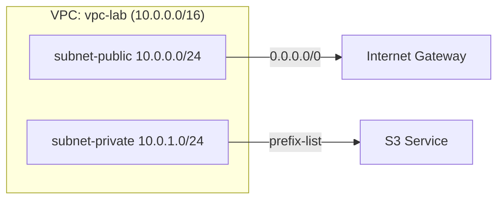

# VPC Basics — Public/Private Subnets + IGW + S3 Gateway Endpoint

**Goal:** 퍼블릭/프라이빗 서브넷 분리와 라우팅 개념을 실제로 구성해 본다.  
**Region:** ap-northeast-1 (Tokyo)  
**Cost:** ¥0 (EC2/NAT/ALB 미사용, S3 Gateway VPCE는 무료)

## Architecture

- 퍼블릭 서브넷: 라우트 테이블에 `0.0.0.0/0 → IGW`가 있으면 퍼블릭
- 프라이빗 서브넷: 인터넷 경로 없음. S3는 **Gateway VPC Endpoint**로 프라이빗 접근

## How to Use (CloudShell/CLI)
```bash
# 1) 생성
bash scripts/setup.sh

# 2) 요약 출력 (리소스 IDs)
bash scripts/verify.sh

# 3) 정리(삭제)
#   - 자동 탐지(태그 기반) 또는 VPC_ID 지정 가능
bash scripts/teardown.sh
# 또는
VPC_ID=<your-vpc-id> bash scripts/teardown.sh
```

## Console Check
- VPC ▸ **Your VPCs**: `vpc-lab`
- Subnets: `subnet-public`, `subnet-private`
- Internet Gateways: `igw-lab` attached
- Route tables: `rtb-public` (0.0.0.0/0 → IGW), `rtb-private` (S3 prefix-list)
- Endpoints: `vpce-s3-gw` (Type=Gateway, Service=S3)
